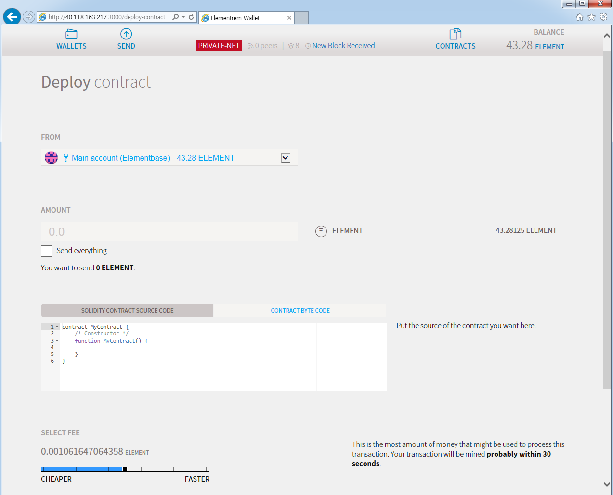

# Azure Elementrem SmartContract


***

- [T/RX Element Lab](#trx-element-lab--step-by-step)      
- [Deploying a simple contract Lab](#deploying-a-simple-contract-lab--step-by-step)
- [Elementrem meteor wallet Lab – Step by Step](#elementrem-meteor-wallet-lab--step-by-step)		

***

- Recommend that Ubuntu Server 16.04 LTS		
- VM(Virtual machine) installation process takes approximately 30 minutes.	
- VM size must be at least A1. ***(If you use A0, The build will fail.)***				
- If you run mining and meteor wallet at the same time, ***VM size must be at least A2.***		
- Elementrem Network listening port = 30707 (Using the `Azure Network security group` to open the port.)

***

### Artifact Parameters

When you launch the installation of the VM, you need to specify the following parameters:
* `Admin User Account`: It must be the same account name for the host.
* `Private Block Extra-data`: This unique string specifies the Private-network of your own. communication between a peer and a peer occurs until after the same `Private Block Extra-data`

***

As well as Due to the highly-developed protocol contracts, all the information is reliable even in a computer environment that can not be trusted. This technology can definitely extend your application.
Provides platform for automating, refining, managing complex processes. Simplification of complex financial derivatives, intelligent and autonomous machines collaboration IoT devices. And You can use the computing power beyond the supercomputer. 

If you specify the right conditions, your requirements will be handled automatically by a Azure connected to the Elementrem BlockChain Node. This is the Highly developed contract code. Validation and calculation, as well as by defining the function was to enable the Turing Complete code development. That's the “smart contract.”

Based on your organization's specific needs, Elementrem can customize your smart contract services by offering both Public node-(Main network) and Private node-based BlockChain tools.

For more Informations, 		
http://www.elementrem.org/		
https://github.com/elementrem/		

***

[**Gele Console Commands. Click Here**](https://github.com/elementrem/go-elementrem/blob/master/gele_command_readme.md)		

***

## T/RX Element Lab – Step by Step

***

**1. Select the desired node Elementrem.**
- Elementrem public node
Run `$ sh ./start_public.sh`
- Elementrem private node
Run `$ sh ./start_private.sh`

During mining or Block Sync, difficult to enter the command due to  a lot of log information.   
However, If you duplicate the session(open up another SSH session connected to the same host.), it is possible to ipc connection.   
In another SSH session `$ sh ./attach_public.sh` or `$ sh ./attach_private.sh`

**2. Create an account.**   
`> personal.newAccount()`   
Output Account Lists `> ele.accounts`

**3. Repeat steps 1-2 to create a second or more VM on you network**

**4. Chaining Network**		
- Public node : The whole process is handled automatically.		
- Private node
You need to manually connect to a peer. 

You can grab the peer url address for instance:		
```
> admin.nodeInfo.enode
"enode://bba499d08a59eb19........77b668ff1eb39d7f2ef@[::]:30707"
```
`[::]` Replace to Azure VM Public IP address

Launch a second node with gele. If you want to connect this instance to the previously started node you can add it as a peer from the console with `admin.addPeer(enodeUrlOfFirstInstance)`
```
admin.addPeer("enode://bba499d08a59eb19........77b668ff1eb39d7f2ef@111.111.111.111:30707")
```

You can test the connection by typing in gele console:
```
> net.listening
true
> net.peerCount 
1
> admin.peers
...
```


**5. Mining Element**
- Public node   
Azure VM is very difficult to mining.   
It is recommended to use an extra [GPU mining](https://github.com/elementrem/webthree-umbrella/releases) or purchasing from a cryptocurrency market

- Private node    
Run `$ miner.start()`		     
More mining Infomations, https://github.com/elementrem/go-elementrem/blob/master/miner.md   
***Transaction will be occurred during the execution of at least one or more of the mining operation. Recommended more than two.***

**6. Check balances**   
Run `> web3.fromMey(ele.getBalance(ele.accounts[0]), "element")`    
ele.accounts[0] - Output first account    
ele.accounts[1] - Output secend account   
Increasing the number you can check a different account.    

**7. Element transfer transaction**   

Command | Explanation
------------ | -------------    
`personal.unlockAccount(ele.accounts[0])` | Unlock Account    
`ele.sendTransaction({from:ele.accounts[0], to:"<Element address of recipient>", value:web3.toMey(<Element amount>, "element"), Gas:21000})` | Element transfer   
`personal.lockAccount(ele.accounts[0])` | Lock Account    
**You also can be Element transfer without Unlock account.**    

Command | Explanation
------------ | -------------
`personal.signAndSendTransaction({from:ele.accounts[0], to: "<Element address of recipient>", value: web3.toMey(<Element amount>, "element"), Gas:21000}, "<account passphrase>")` | Element transfer. *command is not writed on history log.*

**8. Check Transaction**
Run `> ele.getTransaction("<transaction>")`

***

## Deploying a simple contract Lab – Step by Step

***

***Keep in mind that This contract will consume approximately 0.006 Element.***


You should make sure whether the ***solidity compiler*** is applied or not.
```
> ele.getCompilers()
["Solidity"]
```

If the ***solidity*** is not applied, You can apply it manually.
```
> admin.setSolc("/usr/bin/solc")
"solc, the solidity compiler commandline interface\nVersion: 0.3.6-0/None-Linux/g++\n\npath: /usr/bin/solc"
```

- Compiling from the console

The [***Gele console***](https://github.com/elementrem/go-elementrem/blob/master/gele_command_readme.md) actually implmements a JavaScript Runtime Environment. Let's set a variable containing our source code:
```
> var smcontractSource = 'contract SMcontract {   mapping (address => string) entryLog;    function setEntry(string smcontractEntry) {     entryLog[msg.sender] = smcontractEntry;   }    function getMyEntry() constant returns (string) {     return entryLog[msg.sender];   } }'
```

And now we can proceed to compile this source code.

```
> var smcontractCompiled = web3.ele.compile.solidity(smcontractSource);
```

The call to the solidity function returns us a JSON object which contains the EVM byte code   
(smcontractCompiled.SMcontract.code), as well as the ABI definition of the contract   
(smcontractCompiled.SMcontract.info.abiDefinition ).    

- Instantiating a contract    
The next step is to use the web3 elementrem helpers to instantiate a contract object:   
```
> var contract = web3.ele.contract(smcontractCompiled.SMcontract.info.abiDefinition);
```

This will give us an instantiated contract object containing the all important new function. new is what we'll use to actually deploy the contract to your Elementrem network. Since we're in Javascript land, new takes a call back as its final parameter to notify us of successful or failed deployment; lets set up this call back first:

```
> var callback = function(e, contract){
    if(!e) {
      if(!contract.address) {
        console.log("Contract transaction send: TransactionHash: " + contract.transactionHash + " waiting to be confirmed……...");
      } else {
        console.log("Contract confirmed!!!");
        console.log(contract);
      }
    }
}
```

Next we'll need to define the contract initialization object which contains three key/value pairs:

`from` - the address that is posting the contract

`data` - the raw code from the contract

`gas` - the initial gas that we're posting for the contract

Let's construct the initalizer:
```
> var initializer =  {from:web3.ele.accounts[0], data: smcontractCompiled.SMcontract.code, gas: 300000}
```

- Deploying the Contract
We are now ready to deploy! Remember that `new` method? We can finally use it:    
You will need to enter the password you entered when first importing the private key to unlock your account.

`> personal.unlockAccount(personal.listAccounts[0])`

```
> var smcontract = contract.new(initializer, callback);
Contract transaction send: TransactionHash: 0xe37f1551e9daec634f7a87259f5a0b4a3c529f102c092713a48ff10456d96310 waiting to be confirmed……...

        // Wait until the transaction is confirmed.
        // Transaction will be occurred during the execution of at least one or more of the mining operation. Recommended more than two.

Contract confirmed!!!
[object Object]
```

- Writing to the contract
In order for us to write to the entryLog of the contract and have that update stored in the blockchain, we need to send a transaction to the contract address.

```
> smcontract.setEntry.sendTransaction("Hello Elementrem!", {from: ele.accounts[0]});
"0x1d005031f0fc437cb4d797fd9125ffe1a2fe3cdd9e6068d21a34e6ff4b1b86e6"
```

Now if we read from the contract:
(Wait until transaction has confirmed).

```
> smcontract.getMyEntry();
"Hello Elementrem!"
```

Congratulations! Your contract is alive and well on Elementrem blockchain.

***

## Elementrem meteor wallet Lab – Step by Step

***



You can run Elementrem meteor-wallet in the Azure. 

**1. Initialize Elementrem meteor-wallet**		
- Run `sh ./meteor-wallet-setup.sh`		

**2. Setup the wallet parameter**
You need to setting a web3 provider.		
- Run `nano $HOME/meteor-dapp-wallet/app/client/lib/elementrem/1_web3Init.js`		
You can see the following items: In the fifth line.		
`web3 = new Web3(new Web3.providers.HttpProvider("http://localhost:7075"));`		
Please replace the `localhost` with your public IP address. like a `http://111.111.111.111:7075`		
Be sure to save the configuration after making this change.

**3. Start Elementrem meteor-wallet**
- Run `cd $HOME/meteor-dapp-wallet/app && meteor`	
`App running at: http: // localhost: 3000 /` Wait until this message appears....	

**4. Select the desired node Elementrem.**		
Open up another SSH session connected to the same host.		
- Elementrem public node		
Run `$ gele --rpc --rpcaddr 0.0.0.0 --rpccorsdomain "*" console`		
- Elementrem private node		
Run `$ sudo gele --networkid 12345 --identity "private" --datadir "$HOME/.private_elementrem" --rpc --rpcaddr 0.0.0.0 --rpccorsdomain "*" --nodiscover console`		

`Optional add: --unlock <yourAccount>`

**5. Open a browser window and access the URL for your wallet.**		
`http://<Azure VM public IP address>:3000`		

Congratulations! The Meteor wallet is now enabled.